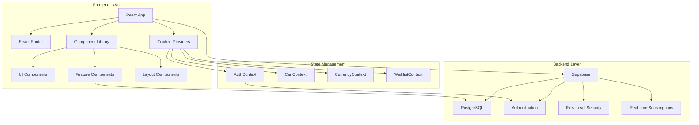
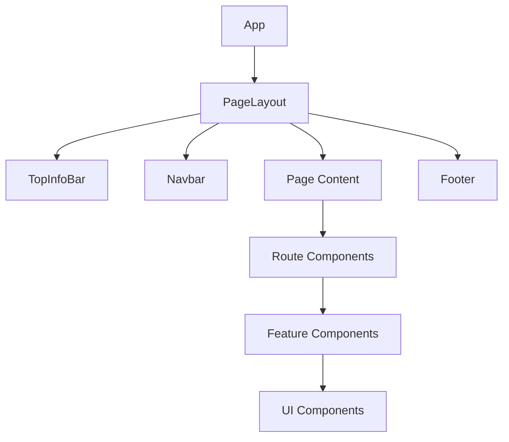
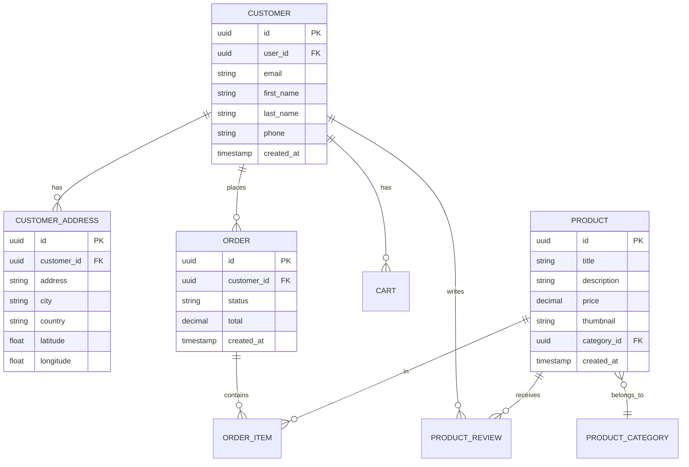
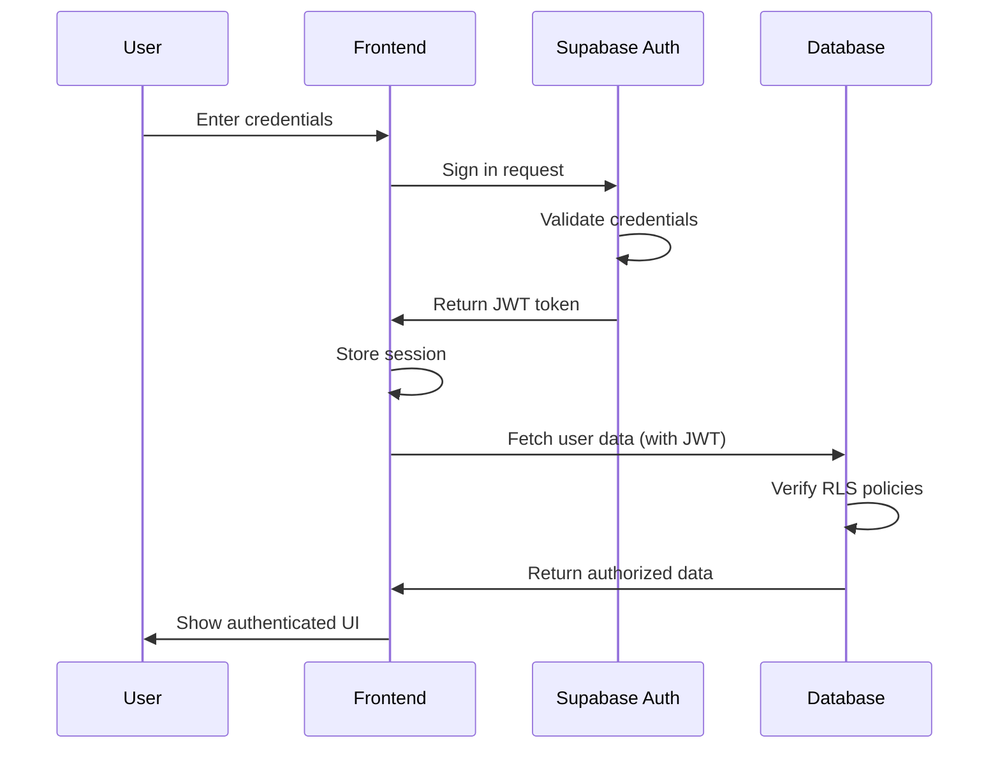

# Architecture Guide

## Overview

Gura is a modern e-commerce platform built with a React frontend and Supabase backend, following a component-based architecture with strong separation of concerns.

## System Architecture



## Frontend Architecture

### Technology Stack

- **React 18**: Modern UI library with concurrent features
- **TypeScript**: Type-safe development
- **Vite**: Fast build tool and dev server
- **React Router v6**: Client-side routing
- **Tailwind CSS**: Utility-first styling
- **shadcn/ui**: High-quality component library
- **React Query**: Server state management

### Project Structure

```
src/
├── components/           # React components
│   ├── account/         # Account management
│   ├── address/         # Address management
│   ├── auth/            # Authentication
│   ├── cart/            # Shopping cart
│   ├── layout/          # Page layouts
│   ├── product/         # Product display
│   └── ui/              # Reusable UI (shadcn)
├── contexts/            # React Context providers
│   ├── AuthContext.tsx
│   ├── CartContext.tsx
│   └── WishlistContext.tsx
├── hooks/               # Custom React hooks
│   ├── useAuth.ts
│   ├── useCart.ts
│   └── useCustomerProfile.ts
├── pages/               # Page components
│   ├── Index.tsx
│   ├── Auth.tsx
│   ├── ProductDetail.tsx
│   └── Account.tsx
├── lib/                 # Utility functions
│   └── utils.ts
├── integrations/        # Third-party integrations
│   └── supabase/
│       ├── client.ts
│       └── types.ts
└── main.tsx            # Application entry point
```

### Component Architecture

#### Component Hierarchy



#### Component Categories

1. **Layout Components**
   - `PageLayout`: Main application wrapper
   - `TopInfoBar`: Top notification banner
   - `Navbar`: Main navigation
   - `Footer`: Site footer

2. **Page Components** (Routes)
   - `Index`: Homepage
   - `Auth`: Login/Signup
   - `ProductDetail`: Product details
   - `Account`: User account dashboard
   - `Cart`: Shopping cart
   - `Checkout`: Checkout flow

3. **Feature Components**
   - Account management (`PersonalInfo`, `Addresses`, `Orders`)
   - Authentication (`LoginForm`, `SignupForm`)
   - Product display (`ProductCard`, `ProductGrid`)
   - Cart management (`CartItem`, `CartSummary`)

4. **UI Components** (shadcn/ui)
   - `Button`, `Input`, `Dialog`, `Toast`, etc.
   - Highly customizable with variants
   - Based on Radix UI primitives

### State Management

#### Context Providers

1. **AuthContext**
   ```typescript
   interface AuthContextType {
     user: User | null;
     isLoading: boolean;
     signUp: (email, password) => Promise<void>;
     signIn: (email, password) => Promise<void>;
     signOut: () => Promise<void>;
   }
   ```

2. **CartContext**
   ```typescript
   interface CartContextType {
     cart: CartItem[];
     addToCart: (product) => void;
     removeFromCart: (productId) => void;
     updateQuantity: (productId, quantity) => void;
     clearCart: () => void;
     total: number;
   }
   ```

3. **WishlistContext**
   ```typescript
   interface WishlistContextType {
     wishlist: Product[];
     addToWishlist: (product) => void;
     removeFromWishlist: (productId) => void;
     isInWishlist: (productId) => boolean;
   }
   ```

#### Custom Hooks

- `useAuth()`: Authentication state and methods
- `useCart()`: Shopping cart management
- `useCustomerProfile()`: User profile data
- `useCheckout()`: Checkout flow management
- `useCurrency()`: Currency formatting
- `useDealNotifications()`: Deal subscriptions

### Routing Architecture

```typescript
// Route structure
<Routes>
  <Route path="/" element={<PageLayout />}>
    {/* Public routes */}
    <Route index element={<Index />} />
    <Route path="auth" element={<Auth />} />
    <Route path="product/:id" element={<ProductDetail />} />
    <Route path="categories/:category" element={<CategoryPage />} />
    
    {/* Protected routes */}
    <Route path="checkout" element={<ProtectedRoute><Checkout /></ProtectedRoute>} />
    <Route path="account/*" element={<ProtectedRoute><Account /></ProtectedRoute>} />
  </Route>
</Routes>
```

See [ROUTING.md](ROUTING.md) for complete routing documentation.

## Backend Architecture

### Supabase Integration

#### Database Layer

- **PostgreSQL**: Relational database
- **Row-Level Security (RLS)**: Table-level access control
- **Foreign Keys**: Referential integrity
- **Triggers**: Automatic timestamp updates
- **Functions**: Stored procedures for complex logic

#### Authentication Layer

- **JWT Tokens**: Secure session management
- **Email/Password**: Primary auth method
- **Social Login**: Ready for OAuth integration
- **User Metadata**: Additional user information
- **Password Recovery**: Secure reset flow

#### Real-time Layer

- **Subscriptions**: Live data updates
- **Presence**: User online status
- **Broadcast**: Real-time messaging

### Database Schema



See [DATABASE.md](DATABASE.md) for complete schema documentation.

## Security Architecture

### Authentication Flow



### Row-Level Security (RLS)

All database tables implement RLS policies:

```sql
-- Example: Customer can only access their own data
CREATE POLICY "customer_select_own"
  ON public.customer
  FOR SELECT
  USING (user_id = auth.uid());

-- Example: Customer can only insert their own addresses
CREATE POLICY "customer_address_insert_own"
  ON public.customer_address
  FOR INSERT
  WITH CHECK (
    EXISTS (
      SELECT 1 FROM public.customer c
      WHERE c.id = customer_address.customer_id
        AND c.user_id = auth.uid()
    )
  );
```

See [SECURITY.md](SECURITY.md) for complete security documentation.

## Design Patterns

### Component Patterns

1. **Container/Presentational Pattern**
   ```typescript
   // Container - handles logic
   export const UserProfileContainer = () => {
     const { user, isLoading } = useCustomerProfile();
     
     if (isLoading) return <Skeleton />;
     
     return <UserProfile user={user} />;
   };
   
   // Presentational - renders UI
   export const UserProfile = ({ user }) => {
     return <div>{user.name}</div>;
   };
   ```

2. **Custom Hooks Pattern**
   ```typescript
   // Encapsulate reusable logic
   export const useCustomerProfile = () => {
     const [customer, setCustomer] = useState(null);
     const [isLoading, setIsLoading] = useState(true);
     
     useEffect(() => {
       fetchCustomer();
     }, []);
     
     return { customer, setCustomer, isLoading };
   };
   ```

3. **Compound Components Pattern**
   ```typescript
   <Card>
     <Card.Header>
       <Card.Title>Title</Card.Title>
     </Card.Header>
     <Card.Content>Content</Card.Content>
   </Card>
   ```

### State Management Patterns

1. **Context + Reducer Pattern**
   ```typescript
   const cartReducer = (state, action) => {
     switch (action.type) {
       case 'ADD_ITEM':
         return { ...state, items: [...state.items, action.payload] };
       case 'REMOVE_ITEM':
         return { ...state, items: state.items.filter(i => i.id !== action.payload) };
       default:
         return state;
     }
   };
   ```

2. **Optimistic Updates**
   ```typescript
   const updateProfile = async (data) => {
     // Update UI immediately
     setCustomer(data);
     
     try {
       // Update database
       await supabase.from('customer').update(data);
     } catch (error) {
       // Revert on error
       setCustomer(previousData);
     }
   };
   ```

## Performance Optimization

### Code Splitting

```typescript
// Lazy load routes
const ProductDetail = lazy(() => import('./pages/ProductDetail'));
const Account = lazy(() => import('./pages/Account'));

// Suspense boundary
<Suspense fallback={<PageLoader />}>
  <Routes>
    <Route path="/product/:id" element={<ProductDetail />} />
  </Routes>
</Suspense>
```

### Memoization

```typescript
// Memoize expensive calculations
const total = useMemo(() => {
  return cart.reduce((sum, item) => sum + item.price * item.quantity, 0);
}, [cart]);

// Memoize callbacks
const handleAddToCart = useCallback((product) => {
  addToCart(product);
}, [addToCart]);
```

### Image Optimization

- Lazy loading with `loading="lazy"`
- Responsive images with `srcset`
- WebP format with fallbacks
- Thumbnail generation

## Error Handling

### Error Boundaries

```typescript
export class ErrorBoundary extends Component {
  componentDidCatch(error, errorInfo) {
    // Log to Sentry
    Sentry.captureException(error, { extra: errorInfo });
  }
  
  render() {
    if (this.state.hasError) {
      return <ErrorFallback />;
    }
    return this.props.children;
  }
}
```

### API Error Handling

```typescript
try {
  const { data, error } = await supabase
    .from('customer')
    .select('*');
    
  if (error) throw error;
  
  return data;
} catch (error) {
  console.error('Error fetching customer:', error);
  toast.error('Failed to load profile');
  Sentry.captureException(error);
}
```

## Deployment Architecture

### Build Process

1. **Development**: Vite dev server with HMR
2. **Build**: Optimized production bundle
3. **Preview**: Test production build locally
4. **Deploy**: Static hosting (Netlify/Vercel)

### Environment Configuration

```typescript
// Vite environment variables
const supabaseUrl = import.meta.env.VITE_SUPABASE_URL;
const supabaseKey = import.meta.env.VITE_SUPABASE_ANON_KEY;
```

## Monitoring & Observability

### Error Tracking

- **Sentry**: Runtime error tracking
- **Source maps**: Production debugging
- **User feedback**: Error reporting

### Performance Monitoring

- **Web Vitals**: Core metrics tracking
- **Lighthouse**: Automated audits
- **Bundle Analysis**: Code splitting optimization

## Future Architecture Considerations

### Scalability

- **CDN**: Static asset distribution
- **Caching**: Redis for session/cart data
- **Load Balancing**: Multiple backend instances
- **Database Optimization**: Query optimization, indexes

### Microservices

- **Payment Service**: Stripe/PayPal integration
- **Notification Service**: Email/SMS notifications
- **Search Service**: Elasticsearch integration
- **Analytics Service**: Data warehouse

### Mobile App

- **React Native**: Code sharing with web
- **Shared Components**: UI library reuse
- **Shared Business Logic**: Custom hooks reuse

---

Last updated: 2025-11-08
