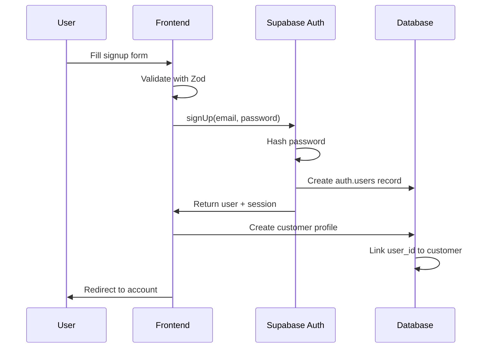
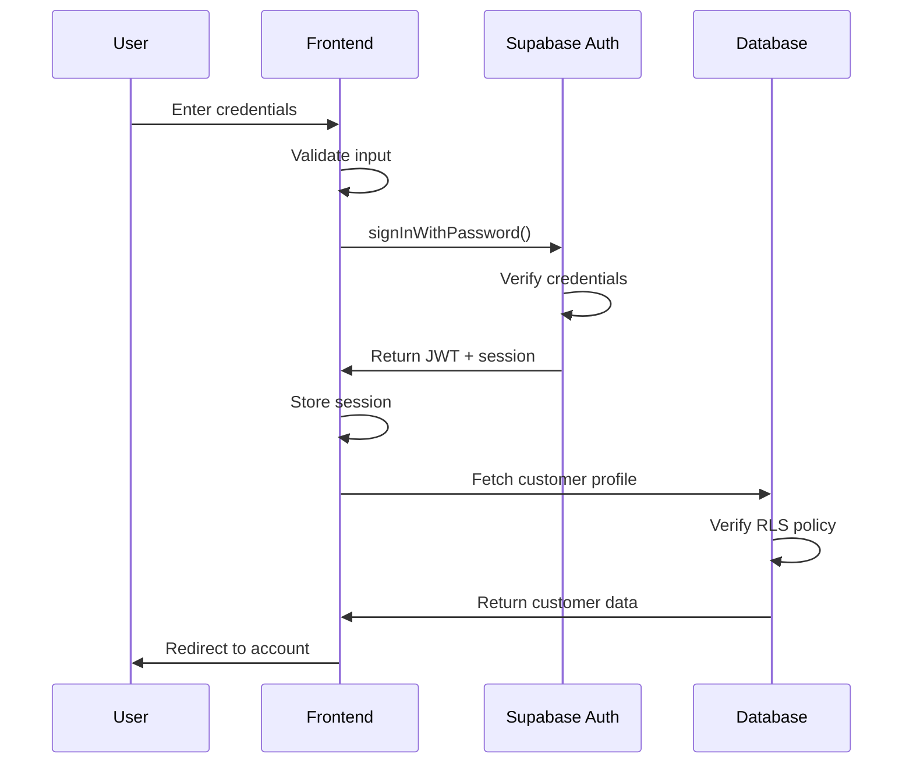
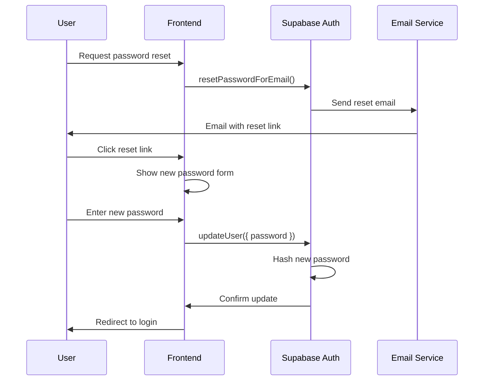
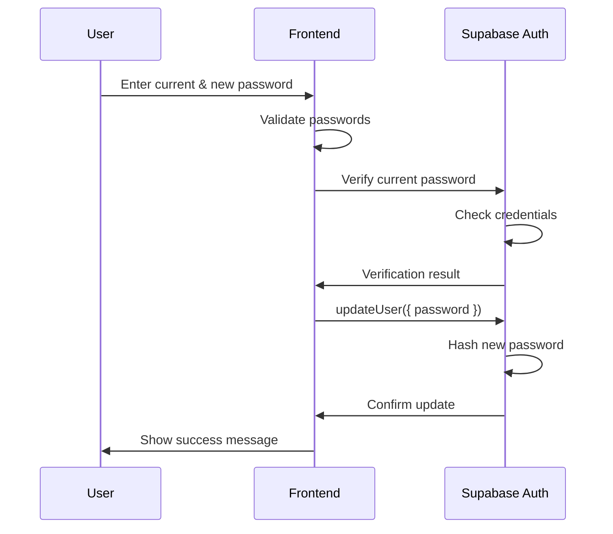

# Authentication Documentation

## Overview

Gura implements a comprehensive authentication system using Supabase Auth with email/password authentication, JWT session management, and Row-Level Security (RLS) for data protection.

## Authentication Flow

### Signup Flow



#### Signup Implementation

```typescript
// SignupForm.tsx
const handleSignup = async (data: SignupFormData) => {
  // 1. Sign up with Supabase Auth
  const { data: authData, error: signUpError } = await supabase.auth.signUp({
    email: data.email,
    password: data.password,
  });

  if (signUpError) throw signUpError;

  // 2. Create customer profile
  const { error: customerError } = await supabase
    .from('customer')
    .insert({
      user_id: authData.user!.id,
      email: data.email,
      first_name: data.firstName,
      last_name: data.lastName,
      phone: data.phone,
    });

  if (customerError) throw customerError;

  // 3. Navigate to account
  navigate('/account');
};
```

#### Signup Validation Schema

```typescript
const signupSchema = z.object({
  email: z.string().email('Invalid email address'),
  password: z.string()
    .min(8, 'Password must be at least 8 characters')
    .regex(/[A-Z]/, 'Password must contain at least one uppercase letter')
    .regex(/[a-z]/, 'Password must contain at least one lowercase letter')
    .regex(/[0-9]/, 'Password must contain at least one number'),
  firstName: z.string().min(1, 'First name is required'),
  lastName: z.string().min(1, 'Last name is required'),
  phone: z.string().min(10, 'Valid phone number is required'),
});
```

### Login Flow



#### Login Implementation

```typescript
// LoginForm.tsx
const handleLogin = async (data: LoginFormData) => {
  const { data: authData, error } = await supabase.auth.signInWithPassword({
    email: data.email,
    password: data.password,
  });

  if (error) {
    toast.error('Invalid email or password');
    return;
  }

  // AuthContext automatically handles session
  navigate('/account');
};
```

### Password Reset Flow



#### Password Reset Implementation

```typescript
// Request reset
const handlePasswordReset = async (email: string) => {
  const { error } = await supabase.auth.resetPasswordForEmail(email, {
    redirectTo: `${window.location.origin}/auth?mode=reset`,
  });

  if (error) throw error;
  toast.success('Password reset email sent');
};

// Update password
const handlePasswordUpdate = async (newPassword: string) => {
  const { error } = await supabase.auth.updateUser({
    password: newPassword,
  });

  if (error) throw error;
  toast.success('Password updated successfully');
  navigate('/auth?mode=login');
};
```

### Password Change Flow (Authenticated)



#### Password Change Implementation

```typescript
// PasswordChangeForm.tsx
const handlePasswordChange = async (data: PasswordChangeData) => {
  // 1. Verify current password
  const { error: verifyError } = await supabase.auth.signInWithPassword({
    email: user!.email!,
    password: data.currentPassword,
  });

  if (verifyError) {
    toast.error('Current password is incorrect');
    return;
  }

  // 2. Update to new password
  const { error: updateError } = await supabase.auth.updateUser({
    password: data.newPassword,
  });

  if (updateError) throw updateError;

  toast.success('Password changed successfully');
  form.reset();
};
```

### Session Management

#### Session Storage

```typescript
// Supabase automatically manages sessions
// Sessions are stored in localStorage by default

// Check session on app load
useEffect(() => {
  supabase.auth.getSession().then(({ data: { session } }) => {
    setSession(session);
    setUser(session?.user ?? null);
  });

  // Listen for auth changes
  const { data: { subscription } } = supabase.auth.onAuthStateChange(
    (_event, session) => {
      setSession(session);
      setUser(session?.user ?? null);
    }
  );

  return () => subscription.unsubscribe();
}, []);
```

#### Session Refresh

```typescript
// Supabase automatically refreshes tokens
// Token refresh happens before expiry (default: 1 hour)

// Manual refresh if needed
const refreshSession = async () => {
  const { data, error } = await supabase.auth.refreshSession();
  if (error) console.error('Session refresh failed:', error);
  return data.session;
};
```

### Logout Flow

```typescript
const handleLogout = async () => {
  const { error } = await supabase.auth.signOut();
  
  if (error) {
    toast.error('Logout failed');
    return;
  }

  // Clear local state
  setUser(null);
  setSession(null);
  
  // Redirect to home
  navigate('/');
  toast.success('Logged out successfully');
};
```

## AuthContext Implementation

```typescript
// contexts/AuthContext.tsx
interface AuthContextType {
  user: User | null;
  session: Session | null;
  isLoading: boolean;
  signUp: (email: string, password: string, metadata?: any) => Promise<void>;
  signIn: (email: string, password: string) => Promise<void>;
  signOut: () => Promise<void>;
  resetPassword: (email: string) => Promise<void>;
  updatePassword: (password: string) => Promise<void>;
}

export const AuthProvider: React.FC<{ children: React.ReactNode }> = ({ children }) => {
  const [user, setUser] = useState<User | null>(null);
  const [session, setSession] = useState<Session | null>(null);
  const [isLoading, setIsLoading] = useState(true);

  useEffect(() => {
    // Initialize session
    supabase.auth.getSession().then(({ data: { session } }) => {
      setSession(session);
      setUser(session?.user ?? null);
      setIsLoading(false);
    });

    // Listen for changes
    const { data: { subscription } } = supabase.auth.onAuthStateChange(
      async (event, session) => {
        setSession(session);
        setUser(session?.user ?? null);
        setIsLoading(false);
      }
    );

    return () => subscription.unsubscribe();
  }, []);

  // ... authentication methods

  return (
    <AuthContext.Provider value={value}>
      {children}
    </AuthContext.Provider>
  );
};
```

## Protected Routes

```typescript
// components/ProtectedRoute.tsx
export const ProtectedRoute: React.FC<{ children: React.ReactNode }> = ({ children }) => {
  const { user, isLoading } = useAuth();
  const location = useLocation();

  if (isLoading) {
    return <PageLoader />;
  }

  if (!user) {
    // Redirect to login, save attempted location
    return <Navigate to="/auth?mode=login" state={{ from: location }} replace />;
  }

  return <>{children}</>;
};

// Usage in routes
<Route 
  path="/account/*" 
  element={
    <ProtectedRoute>
      <Account />
    </ProtectedRoute>
  } 
/>
```

## Customer Profile System

### Profile Creation

```typescript
// After successful signup
const createCustomerProfile = async (userId: string, data: SignupData) => {
  const { error } = await supabase
    .from('customer')
    .insert({
      user_id: userId,
      email: data.email,
      first_name: data.firstName,
      last_name: data.lastName,
      phone: data.phone,
    });

  if (error) throw error;
};
```

### Profile Update

```typescript
// PersonalInfoForm.tsx
const updateProfile = async (data: ProfileData) => {
  const { error } = await supabase
    .from('customer')
    .update({
      first_name: data.firstName,
      last_name: data.lastName,
      phone: data.phone,
    })
    .eq('user_id', user!.id);

  if (error) throw error;
  toast.success('Profile updated successfully');
};
```

### Phone Number Management

Phone numbers are collected during signup and stored in the customer table:

```typescript
interface Customer {
  id: string;
  user_id: string;
  email: string;
  first_name: string;
  last_name: string;
  phone: string;  // Required during signup
  created_at: string;
  updated_at: string;
}
```

## Security Implementation

### Password Requirements

- Minimum 8 characters
- At least one uppercase letter
- At least one lowercase letter
- At least one number
- Special characters encouraged but not required

### Current Password Verification

When changing password, users must verify their current password:

```typescript
const verifyCurrentPassword = async (currentPassword: string, email: string) => {
  const { error } = await supabase.auth.signInWithPassword({
    email,
    password: currentPassword,
  });

  return !error; // Returns true if password is correct
};
```

### Row-Level Security (RLS)

#### Customer Table Policies

```sql
-- Users can view their own customer record
CREATE POLICY "customer_select_own"
  ON public.customer
  FOR SELECT
  USING (user_id = auth.uid() OR email = (auth.jwt() ->> 'email'));

-- Users can insert their own customer record
CREATE POLICY "customer_insert_own"
  ON public.customer
  FOR INSERT
  WITH CHECK (user_id = auth.uid() AND email = (auth.jwt() ->> 'email'));

-- Users can update their own customer record
CREATE POLICY "customer_update_own"
  ON public.customer
  FOR UPDATE
  USING (user_id = auth.uid())
  WITH CHECK (user_id = auth.uid());
```

### JWT Token Structure

```json
{
  "aud": "authenticated",
  "exp": 1699999999,
  "iat": 1699996399,
  "iss": "https://your-project.supabase.co/auth/v1",
  "sub": "user-uuid-here",
  "email": "user@example.com",
  "phone": "",
  "app_metadata": {
    "provider": "email",
    "providers": ["email"]
  },
  "user_metadata": {
    "firstName": "John",
    "lastName": "Doe"
  },
  "role": "authenticated"
}
```

## Error Handling

### Common Authentication Errors

```typescript
const handleAuthError = (error: AuthError) => {
  switch (error.message) {
    case 'Invalid login credentials':
      toast.error('Invalid email or password');
      break;
    case 'Email not confirmed':
      toast.error('Please confirm your email address');
      break;
    case 'User already registered':
      toast.error('An account with this email already exists');
      break;
    default:
      toast.error('An error occurred. Please try again.');
      Sentry.captureException(error);
  }
};
```

### Rate Limiting

Supabase implements rate limiting on authentication endpoints:
- **Signup**: 5 requests per hour per IP
- **Login**: 10 requests per hour per IP
- **Password reset**: 5 requests per hour per email

## Best Practices

### Security

1. ✅ **Never store passwords in plain text**
2. ✅ **Use HTTPS only in production**
3. ✅ **Implement CSRF protection**
4. ✅ **Validate all user input**
5. ✅ **Use secure session storage**
6. ✅ **Implement rate limiting**
7. ✅ **Log authentication events**

### User Experience

1. ✅ **Show clear error messages**
2. ✅ **Provide password strength indicator**
3. ✅ **Remember user email (optional)**
4. ✅ **Implement "Forgot Password" flow**
5. ✅ **Use loading states**
6. ✅ **Redirect after successful auth**
7. ✅ **Auto-focus on first input**

### Development

1. ✅ **Use TypeScript for type safety**
2. ✅ **Validate with Zod schemas**
3. ✅ **Handle errors gracefully**
4. ✅ **Test authentication flows**
5. ✅ **Monitor authentication metrics**
6. ✅ **Use environment variables**

## Testing

### Unit Tests

```typescript
describe('Authentication', () => {
  it('should validate email format', () => {
    const result = signupSchema.safeParse({
      email: 'invalid-email',
      password: 'ValidPass123',
    });
    expect(result.success).toBe(false);
  });

  it('should require strong password', () => {
    const result = signupSchema.safeParse({
      email: 'test@example.com',
      password: 'weak',
    });
    expect(result.success).toBe(false);
  });
});
```

### E2E Tests

```typescript
describe('Signup Flow', () => {
  it('should create account and redirect', () => {
    cy.visit('/auth?mode=signup');
    cy.get('[name="email"]').type('test@example.com');
    cy.get('[name="password"]').type('ValidPass123');
    cy.get('[name="firstName"]').type('John');
    cy.get('[name="lastName"]').type('Doe');
    cy.get('[name="phone"]').type('1234567890');
    cy.get('button[type="submit"]').click();
    cy.url().should('include', '/account');
  });
});
```

## Troubleshooting

See [TROUBLESHOOTING.md](TROUBLESHOOTING.md) for common authentication issues and solutions.

---

Last updated: 2025-11-08
