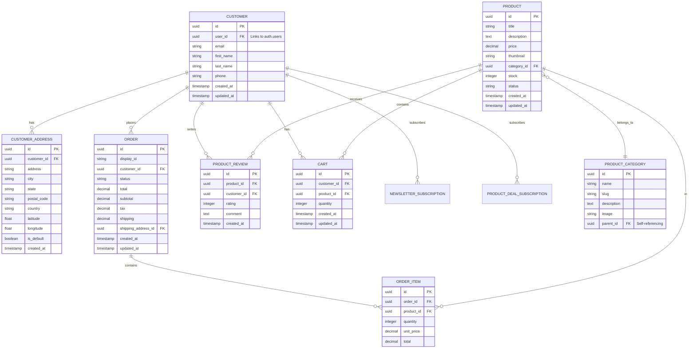

# Database Documentation

## Overview

Gura uses Supabase (PostgreSQL) as its database with comprehensive Row-Level Security (RLS) policies to ensure data isolation and security.

## Database Schema

### Entity Relationship Diagram



## Core Tables

### customer

Stores customer profile information linked to auth users.

```sql
CREATE TABLE public.customer (
  id UUID PRIMARY KEY DEFAULT gen_random_uuid(),
  user_id UUID REFERENCES auth.users(id) ON DELETE CASCADE,
  email TEXT NOT NULL UNIQUE,
  first_name TEXT,
  last_name TEXT,
  phone TEXT,
  created_at TIMESTAMP WITH TIME ZONE DEFAULT NOW(),
  updated_at TIMESTAMP WITH TIME ZONE DEFAULT NOW()
);

-- Index for fast lookups
CREATE INDEX idx_customer_user_id ON public.customer(user_id);
CREATE INDEX idx_customer_email ON public.customer(email);

-- Trigger for updated_at
CREATE TRIGGER update_customer_updated_at
  BEFORE UPDATE ON public.customer
  FOR EACH ROW
  EXECUTE FUNCTION update_updated_at_column();
```

**Key Fields:**
- `user_id`: Links to Supabase auth.users table
- `email`: Must match the auth user's email
- `phone`: Required during signup

### customer_address

Stores multiple delivery addresses per customer with geocoding.

```sql
CREATE TABLE public.customer_address (
  id UUID PRIMARY KEY DEFAULT gen_random_uuid(),
  customer_id UUID NOT NULL REFERENCES public.customer(id) ON DELETE CASCADE,
  first_name TEXT,
  last_name TEXT,
  address TEXT NOT NULL,
  city TEXT,
  state TEXT,
  postal_code TEXT,
  country TEXT DEFAULT 'Rwanda',
  latitude FLOAT,
  longitude FLOAT,
  is_default BOOLEAN DEFAULT FALSE,
  created_at TIMESTAMP WITH TIME ZONE DEFAULT NOW(),
  updated_at TIMESTAMP WITH TIME ZONE DEFAULT NOW()
);

-- Indexes
CREATE INDEX idx_customer_address_customer_id ON public.customer_address(customer_id);
CREATE INDEX idx_customer_address_coords ON public.customer_address(latitude, longitude);
```

**Key Fields:**
- `customer_id`: Foreign key to customer
- `latitude/longitude`: Geocoded coordinates for mapping
- `is_default`: Marks primary delivery address

### product

Product catalog with pricing and inventory.

```sql
CREATE TABLE public.product (
  id UUID PRIMARY KEY DEFAULT gen_random_uuid(),
  title TEXT NOT NULL,
  handle TEXT UNIQUE,
  description TEXT,
  price DECIMAL(10, 2) NOT NULL,
  thumbnail TEXT,
  category_id UUID REFERENCES public.product_category(id),
  stock INTEGER DEFAULT 0,
  status TEXT DEFAULT 'active',
  created_at TIMESTAMP WITH TIME ZONE DEFAULT NOW(),
  updated_at TIMESTAMP WITH TIME ZONE DEFAULT NOW()
);

-- Indexes for search and filtering
CREATE INDEX idx_product_category ON public.product(category_id);
CREATE INDEX idx_product_status ON public.product(status);
CREATE INDEX idx_product_handle ON public.product(handle);
CREATE INDEX idx_product_title ON public.product USING GIN(to_tsvector('english', title));
```

**Key Fields:**
- `handle`: URL-friendly slug
- `price`: Decimal for accurate pricing
- `stock`: Inventory tracking
- `status`: 'active', 'draft', 'archived'

### product_category

Hierarchical product categorization.

```sql
CREATE TABLE public.product_category (
  id UUID PRIMARY KEY DEFAULT gen_random_uuid(),
  name TEXT NOT NULL,
  slug TEXT UNIQUE NOT NULL,
  description TEXT,
  image TEXT,
  parent_id UUID REFERENCES public.product_category(id),
  created_at TIMESTAMP WITH TIME ZONE DEFAULT NOW()
);

-- Support nested categories
CREATE INDEX idx_category_parent ON public.product_category(parent_id);
```

**Features:**
- Hierarchical structure (parent_id self-reference)
- URL slugs for SEO
- Category images for display

### order

Customer order tracking.

```sql
CREATE TABLE public.order (
  id UUID PRIMARY KEY DEFAULT gen_random_uuid(),
  display_id TEXT UNIQUE NOT NULL,
  customer_id UUID REFERENCES public.customer(id),
  status TEXT DEFAULT 'pending',
  total DECIMAL(10, 2) NOT NULL,
  subtotal DECIMAL(10, 2) NOT NULL,
  tax DECIMAL(10, 2) DEFAULT 0,
  shipping DECIMAL(10, 2) DEFAULT 0,
  shipping_address_id UUID REFERENCES public.customer_address(id),
  created_at TIMESTAMP WITH TIME ZONE DEFAULT NOW(),
  updated_at TIMESTAMP WITH TIME ZONE DEFAULT NOW()
);

-- Indexes
CREATE INDEX idx_order_customer ON public.order(customer_id);
CREATE INDEX idx_order_status ON public.order(status);
CREATE INDEX idx_order_display_id ON public.order(display_id);
```

**Order Statuses:**
- `pending`: Order placed, awaiting processing
- `processing`: Being prepared
- `out_for_delivery`: In transit
- `delivered`: Completed
- `canceled`: Canceled by user/admin

### order_item

Line items for orders.

```sql
CREATE TABLE public.order_item (
  id UUID PRIMARY KEY DEFAULT gen_random_uuid(),
  order_id UUID NOT NULL REFERENCES public.order(id) ON DELETE CASCADE,
  product_id UUID REFERENCES public.product(id),
  quantity INTEGER NOT NULL,
  unit_price DECIMAL(10, 2) NOT NULL,
  total DECIMAL(10, 2) NOT NULL,
  created_at TIMESTAMP WITH TIME ZONE DEFAULT NOW()
);

CREATE INDEX idx_order_item_order ON public.order_item(order_id);
```

### cart

Shopping cart for authenticated users.

```sql
CREATE TABLE public.cart (
  id UUID PRIMARY KEY DEFAULT gen_random_uuid(),
  customer_id UUID NOT NULL REFERENCES public.customer(id) ON DELETE CASCADE,
  product_id UUID NOT NULL REFERENCES public.product(id) ON DELETE CASCADE,
  quantity INTEGER NOT NULL DEFAULT 1,
  created_at TIMESTAMP WITH TIME ZONE DEFAULT NOW(),
  updated_at TIMESTAMP WITH TIME ZONE DEFAULT NOW(),
  UNIQUE(customer_id, product_id)
);

CREATE INDEX idx_cart_customer ON public.cart(customer_id);
```

**Features:**
- Persistent cart across sessions
- Unique constraint prevents duplicate products
- Automatic cleanup on product deletion

### product_review

Customer product reviews and ratings.

```sql
CREATE TABLE public.product_review (
  id UUID PRIMARY KEY DEFAULT gen_random_uuid(),
  product_id UUID NOT NULL REFERENCES public.product(id) ON DELETE CASCADE,
  customer_id UUID NOT NULL REFERENCES public.customer(id) ON DELETE CASCADE,
  rating INTEGER NOT NULL CHECK (rating >= 1 AND rating <= 5),
  comment TEXT,
  created_at TIMESTAMP WITH TIME ZONE DEFAULT NOW(),
  UNIQUE(product_id, customer_id)
);

CREATE INDEX idx_review_product ON public.product_review(product_id);
CREATE INDEX idx_review_customer ON public.product_review(customer_id);
```

**Features:**
- Rating: 1-5 stars
- One review per customer per product
- Cascade delete with product/customer

## Supporting Tables

### newsletter_subscriptions

Email marketing subscriptions.

```sql
CREATE TABLE public.newsletter_subscriptions (
  id UUID PRIMARY KEY DEFAULT gen_random_uuid(),
  email TEXT NOT NULL UNIQUE,
  subscribed BOOLEAN DEFAULT TRUE,
  created_at TIMESTAMP WITH TIME ZONE DEFAULT NOW()
);
```

### product_deal_subscriptions

Deal notification subscriptions.

```sql
CREATE TABLE public.product_deal_subscriptions (
  id UUID PRIMARY KEY DEFAULT gen_random_uuid(),
  customer_id UUID REFERENCES public.customer(id) ON DELETE CASCADE,
  product_id UUID REFERENCES public.product(id) ON DELETE CASCADE,
  subscribed BOOLEAN DEFAULT TRUE,
  created_at TIMESTAMP WITH TIME ZONE DEFAULT NOW(),
  UNIQUE(customer_id, product_id)
);
```

### promotional_banners

Marketing banner management.

```sql
CREATE TABLE public.promotional_banners (
  id UUID PRIMARY KEY DEFAULT gen_random_uuid(),
  title TEXT NOT NULL,
  description TEXT,
  image_url TEXT,
  link_url TEXT,
  is_active BOOLEAN DEFAULT TRUE,
  display_order INTEGER DEFAULT 0,
  created_at TIMESTAMP WITH TIME ZONE DEFAULT NOW()
);
```

### profiles

Extended user preferences (separate from customer).

```sql
CREATE TABLE public.profiles (
  id UUID PRIMARY KEY REFERENCES auth.users(id) ON DELETE CASCADE,
  username TEXT UNIQUE,
  avatar_url TEXT,
  preferences JSONB,
  created_at TIMESTAMP WITH TIME ZONE DEFAULT NOW(),
  updated_at TIMESTAMP WITH TIME ZONE DEFAULT NOW()
);
```

### audit_log

Security and compliance tracking.

```sql
CREATE TABLE public.audit_log (
  id UUID PRIMARY KEY DEFAULT gen_random_uuid(),
  user_id UUID REFERENCES auth.users(id),
  action TEXT NOT NULL,
  table_name TEXT,
  record_id UUID,
  old_data JSONB,
  new_data JSONB,
  ip_address TEXT,
  created_at TIMESTAMP WITH TIME ZONE DEFAULT NOW()
);

CREATE INDEX idx_audit_user ON public.audit_log(user_id);
CREATE INDEX idx_audit_table ON public.audit_log(table_name);
```

### rate_limits

API rate limiting.

```sql
CREATE TABLE public.rate_limits (
  id UUID PRIMARY KEY DEFAULT gen_random_uuid(),
  identifier TEXT NOT NULL,
  endpoint TEXT NOT NULL,
  count INTEGER DEFAULT 0,
  window_start TIMESTAMP WITH TIME ZONE DEFAULT NOW(),
  UNIQUE(identifier, endpoint)
);
```

## Row-Level Security (RLS) Policies

### Customer Table Policies

```sql
-- Enable RLS
ALTER TABLE public.customer ENABLE ROW LEVEL SECURITY;

-- Users can view their own customer record
CREATE POLICY "customer_select_own"
  ON public.customer
  FOR SELECT
  USING (user_id = auth.uid() OR email = (auth.jwt() ->> 'email'));

-- Users can insert their own customer record
CREATE POLICY "customer_insert_own"
  ON public.customer
  FOR INSERT
  WITH CHECK (user_id = auth.uid() AND email = (auth.jwt() ->> 'email'));

-- Users can update their own customer record
CREATE POLICY "customer_update_own"
  ON public.customer
  FOR UPDATE
  USING (user_id = auth.uid())
  WITH CHECK (user_id = auth.uid());
```

### Customer Address Policies

```sql
ALTER TABLE public.customer_address ENABLE ROW LEVEL SECURITY;

-- Users can view their own addresses
CREATE POLICY "customer_address_select_own"
  ON public.customer_address
  FOR SELECT
  USING (
    EXISTS (
      SELECT 1 FROM public.customer c
      WHERE c.id = customer_address.customer_id
        AND c.user_id = auth.uid()
    )
  );

-- Users can insert their own addresses
CREATE POLICY "customer_address_insert_own"
  ON public.customer_address
  FOR INSERT
  WITH CHECK (
    EXISTS (
      SELECT 1 FROM public.customer c
      WHERE c.id = customer_address.customer_id
        AND c.user_id = auth.uid()
    )
  );

-- Users can update their own addresses
CREATE POLICY "customer_address_update_own"
  ON public.customer_address
  FOR UPDATE
  USING (
    EXISTS (
      SELECT 1 FROM public.customer c
      WHERE c.id = customer_address.customer_id
        AND c.user_id = auth.uid()
    )
  );

-- Users can delete their own addresses
CREATE POLICY "customer_address_delete_own"
  ON public.customer_address
  FOR DELETE
  USING (
    EXISTS (
      SELECT 1 FROM public.customer c
      WHERE c.id = customer_address.customer_id
        AND c.user_id = auth.uid()
    )
  );
```

### Product Table Policies

```sql
ALTER TABLE public.product ENABLE ROW LEVEL SECURITY;

-- Everyone can view active products
CREATE POLICY "product_select_active"
  ON public.product
  FOR SELECT
  USING (status = 'active');
```

### Cart Policies

```sql
ALTER TABLE public.cart ENABLE ROW LEVEL SECURITY;

-- Users can manage their own cart
CREATE POLICY "cart_all_own"
  ON public.cart
  FOR ALL
  USING (
    EXISTS (
      SELECT 1 FROM public.customer c
      WHERE c.id = cart.customer_id
        AND c.user_id = auth.uid()
    )
  )
  WITH CHECK (
    EXISTS (
      SELECT 1 FROM public.customer c
      WHERE c.id = cart.customer_id
        AND c.user_id = auth.uid()
    )
  );
```

### Order Policies

```sql
ALTER TABLE public.order ENABLE ROW LEVEL SECURITY;

-- Users can view their own orders
CREATE POLICY "order_select_own"
  ON public.order
  FOR SELECT
  USING (
    EXISTS (
      SELECT 1 FROM public.customer c
      WHERE c.id = order.customer_id
        AND c.user_id = auth.uid()
    )
  );
```

## Database Functions

### Update Updated_At Trigger

```sql
CREATE OR REPLACE FUNCTION update_updated_at_column()
RETURNS TRIGGER AS $$
BEGIN
  NEW.updated_at = NOW();
  RETURN NEW;
END;
$$ LANGUAGE plpgsql;
```

### Calculate Order Total

```sql
CREATE OR REPLACE FUNCTION calculate_order_total(order_uuid UUID)
RETURNS DECIMAL AS $$
DECLARE
  order_total DECIMAL;
BEGIN
  SELECT SUM(total) INTO order_total
  FROM public.order_item
  WHERE order_id = order_uuid;
  
  RETURN COALESCE(order_total, 0);
END;
$$ LANGUAGE plpgsql;
```

## Indexes

### Performance Indexes

```sql
-- Customer lookups
CREATE INDEX idx_customer_user_id ON public.customer(user_id);
CREATE INDEX idx_customer_email ON public.customer(email);

-- Address geolocation
CREATE INDEX idx_customer_address_coords ON public.customer_address(latitude, longitude);

-- Product search
CREATE INDEX idx_product_title_search ON public.product USING GIN(to_tsvector('english', title));
CREATE INDEX idx_product_category ON public.product(category_id);

-- Order queries
CREATE INDEX idx_order_customer ON public.order(customer_id);
CREATE INDEX idx_order_status ON public.order(status);
CREATE INDEX idx_order_created_at ON public.order(created_at DESC);

-- Cart queries
CREATE INDEX idx_cart_customer ON public.cart(customer_id);
```

## Migrations

Migrations are stored in `supabase/migrations/` and applied in order:

```
supabase/migrations/
├── 20240101000000_initial_schema.sql
├── 20240102000000_add_customer_tables.sql
├── 20240103000000_add_product_tables.sql
├── 20240104000000_add_order_tables.sql
└── 20251108174200_fix_customer_rls.sql
```

## Best Practices

### Data Integrity

1. ✅ **Use foreign keys** for referential integrity
2. ✅ **Add constraints** for data validation
3. ✅ **Use UUIDs** for primary keys
4. ✅ **Implement cascade deletes** where appropriate
5. ✅ **Add unique constraints** to prevent duplicates

### Performance

1. ✅ **Create indexes** on frequently queried columns
2. ✅ **Use GIN indexes** for full-text search
3. ✅ **Analyze queries** with EXPLAIN
4. ✅ **Denormalize sparingly** when needed
5. ✅ **Archive old data** to improve query speed

### Security

1. ✅ **Enable RLS** on all user-accessible tables
2. ✅ **Test RLS policies** thoroughly
3. ✅ **Use parameterized queries** to prevent SQL injection
4. ✅ **Audit sensitive operations** in audit_log
5. ✅ **Encrypt sensitive data** at rest

## Backup and Recovery

### Automated Backups

Supabase provides:
- Daily automated backups
- Point-in-time recovery (PITR)
- 7-day retention on free tier
- Extended retention on paid tiers

### Manual Backups

```bash
# Export database schema
pg_dump -h db.your-project.supabase.co -U postgres --schema-only > schema.sql

# Export data
pg_dump -h db.your-project.supabase.co -U postgres --data-only > data.sql

# Full backup
pg_dump -h db.your-project.supabase.co -U postgres > backup.sql
```

## Monitoring

### Query Performance

```sql
-- Slow queries
SELECT query, calls, mean_exec_time
FROM pg_stat_statements
ORDER BY mean_exec_time DESC
LIMIT 10;

-- Table sizes
SELECT
  schemaname,
  tablename,
  pg_size_pretty(pg_total_relation_size(schemaname||'.'||tablename)) AS size
FROM pg_tables
WHERE schemaname = 'public'
ORDER BY pg_total_relation_size(schemaname||'.'||tablename) DESC;
```

---

Last updated: 2025-11-08
